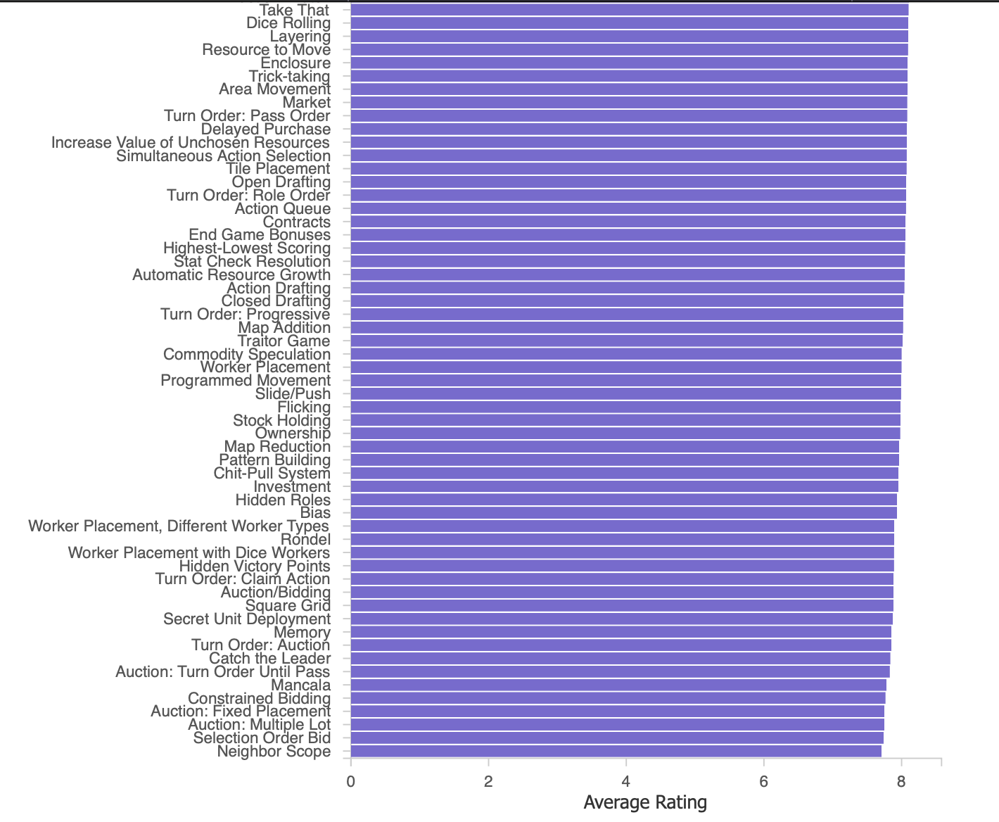

## Project: Visual Analytics

- [x] Step 1: Setup (changes made: bump up node version, reorganize template a bit, filename is not boardgame_40.json)
- [x] Step 2: Download the dataset and explore manually
- [x] Step 3. Group analysis for developer
- [ ] Step 4: LDA
- [ ] Step 5: Pipeline
- [ ] Step 6: Presentation
- [ ] Step 7: Beutify

### Set-up

Follow the notes provided by course organizers in [templete.pdf](template.pdf) for setup of environment.

### Representation ideas:

Sliders for min-max players and min-max play time and range of years and also age maybe
Tags for categories, mechanics (??)

### Task-1: Define an analysis task with 5-tuple from game developer point of view (Group)

> “Explore the average ratin got games grouped by their mechanics to
   understand which game mechanics are most well-received by players”

#### 5-Tuple Breakdown:

- Goal: Explore
- Means: Derived (aggregated average rating)
- Characteristics: Group (by game mechanic)
- Target: rating
- Cardinality: multiple groups (N -> 1)
- Visualization: Grouped bar chat (maybe with top and bottom N) with X-axis mechanics and y (rating)

**Other ideas explored**:

mechanics interest might vary with age groups (so triple axis plot?)

#### Preprocess data:

iterate and get grouped averages. Make plot

#### Design decision:

- chose to calculate mean in one go rather than line by line to save
ram like in template. Ok for small size like outs. Possible for larger
datasets with additional libraries. Or better to preprocess and store
in another file
- not parsing data as unlike csv datatype is automatically detected in
json
- change module style to ES modules from CommonJS modules (import and
export keyword instead of require)
- interactive barplot (if time)

### Task 2: Define analysis task with 5-tuple from game developer point of view (Compare)

> Compare board games based on mechanics (attributes), across
  different average rating bands (e.g., high vs low rated games),
  using a projection into 2D space.

#### 5-Tuple Breakdown:
 - Goal: Compare
 - Target: Board games
 - Attributes: Game mechanics
 - Scope: Games with at least N reviews (to ensure rating is reliable)
 - Structure: High-dimensional binary vector (one-hot encoded mechanics)

**Other ideas explored**:

way to change parameter of PCA interactively

#### Design decision:

 - get one-hot encoding by splting rating into 3 categories. high, medium, low
 - then project into lower dimension
 - expected: similar mechanics cluster together. kinda true as we see high up alone.
 - problems: couldn't find inverse of matrix, determinant is zero.
   probably due to high correlation. pca helps here. so pca, then lda works.

### Task 3: